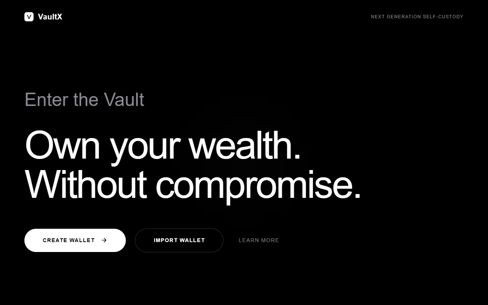

<div align="center" style="font-family: 'Helvetica Neue', Helvetica, Arial, sans-serif;">

<br/>
<br/>

<pre style="font-family: monospace; font-size: 8px; line-height: 1.0; letter-spacing: 1px; color: #52525b; display: inline-block; text-align: center; font-weight: bold;">
   ,~:=*#$$$$#*!=;:~-,.            ...........            .,-~:;=!*#$$$$#*=:~,  
 .,~;!*#$$$$#*=;:~-,.         ...,,,,-------,,,,...         .,-~:;=*#$$$$#*!;~,.
.,~;!#$$$$#*!=:~-,.       ...,,--~~~~:::::::~~~~--,,...       .,-~:=!*#$$$$#!;~,
,~;!#$$$$#*!;:-,.       ..,--~~::;;;=========;;;::~~--,..       .,-:;!*#$$$$#!;~
~;!#$$$$#*=;~-,.      .,,-~~:;;==!!!!*******!!!!==;;:~~-,,.      .,-~;=*#$$$$#!;
;!#$$$$#!=:~,.      .,,-~:;;=!!***#############***!!=;;:~-,,.      .,~:=!#$$$$#!
!*$$$$#!=:~,.     ..,-~:;==!**####$$$$$$$$$$$$$####**!==;:~-,..     .,~:=!#$$$$*
*#$$$#*=:~,.     .,-~:;;=!**##$$$$$$$$$$$$$$$$$$$$$##**!=;;:~-,.     .,~:=*#$$$#
#$$$#*=:~,.     .,-~:;=!**##$$$$$$$$$$$$$$$$$$$$$$$$$##**!=;:~-,.     .,~:=*#$$$
$$$$*!;~-.     .,-~:;=!*##$$$$$$$$$$$$$$$$$$$$$$$$$$$$$##*!=;:~-,.     .-~;!*$$$
$$$#!;:-.     .,-~:=!**#$$$$$$$$$$$$$$$$$$$$$$$$$$$$$$$$$#**!=:~-,.     .-:;!#$$
$$#*=:~,.    .,-~:=!**#$$$$$$$$$$$#############$$$$$$$$$$$#**!=:~-,.    .,~:=*#$
$$#!;~-.    ..-~:;!**#$$$$$$$$$$####*********####$$$$$$$$$$#**!;:~-..    .-~;!#$
$#*=:-,.    .,-:;=!*#$$$$$$$$$###*****!!!!!*****###$$$$$$$$$#*!=;:-,.    .,-:=*#
$#!;:-.    .,-~;=!*#$$$$$$$$$##***!!!!!!!!!!!!!***##$$$$$$$$$#*!=;~-,.    .-:;!#
$*!;~,.    .,-:;=*##$$$$$$$$##***!!!=========!!!***##$$$$$$$$##*=;:-,.    .,~;!*
$*=:-,     .-~:=!*#$$$$$$$$##**!!!=====;;;=====!!!**##$$$$$$$$#*!=:~-.     ,-:=*
#*=:-.    .,-~;=!*#$$$$$$$###**!!===;;;;;;;;;===!!**###$$$$$$$#*!=;~-,.    .-:=*
#!=:-.    .,-:;=*##$$$$$$$##**!!===;;;;;;;;;;;===!!**##$$$$$$$##*=;:-,.    .-:=!
#!;~-.    .,-:;!*##$$$$$$$##**!!===;;;;;;;;;;;===!!**##$$$$$$$##*!;:-,.    .-~;!
#!;~-.    .,-:;!*#$$$$$$$$##**!!==;;;;;;;;;;;;;==!!**##$$$$$$$$#*!;:-,.    .-~;!
#!;~-.    .,-:;!*##$$$$$$$##**!!===;;;;;;;;;;;===!!**##$$$$$$$##*!;:-,.    .-~;!
#!=:-.    .,-:;=*##$$$$$$$##**!!===;;;;;;;;;;;===!!**##$$$$$$$##*=;:-,.    .-:=!
#*=:-.    .,-~;=!*#$$$$$$$###**!!===;;;;;;;;;===!!**###$$$$$$$#*!=;~-,.    .-:=*
$*=:-,     .-~:=!*#$$$$$$$$##**!!!=====;;;=====!!!**##$$$$$$$$#*!=:~-.     ,-:=*
$*!;~,.    .,-:;=*##$$$$$$$$##***!!!=========!!!***##$$$$$$$$##*=;:-,.    .,~;!*
$#!;:-.    .,-~;=!*#$$$$$$$$$##***!!!!!!!!!!!!!***##$$$$$$$$$#*!=;~-,.    .-:;!#
$#*=:-,.    .,-:;=!*#$$$$$$$$$###*****!!!!!*****###$$$$$$$$$#*!=;:-,.    .,-:=*#
$$#!;~-.    ..-~:;!**#$$$$$$$$$$####*********####$$$$$$$$$$#**!;:~-..    .-~;!#$
$$#*=:~,.    .,-~:=!**#$$$$$$$$$$$#############$$$$$$$$$$$#**!=:~-,.    .,~:=*#$
$$$#!;:-.     .,-~:=!**#$$$$$$$$$$$$$$$$$$$$$$$$$$$$$$$$$#**!=:~-,.     .-:;!#$$
$$$$*!;~-.     .,-~:;=!*##$$$$$$$$$$$$$$$$$$$$$$$$$$$$$##*!=;:~-,.     .-~;!*$$$
#$$$#*=:~,.     .,-~:;=!**##$$$$$$$$$$$$$$$$$$$$$$$$$##**!=;:~-,.     .,~:=*#$$$
*#$$$#*=:~,.     .,-~:;;=!**##$$$$$$$$$$$$$$$$$$$$$##**!=;;:~-,.     .,~:=*#$$$#
!*$$$$#!=:~,.     ..,-~:;==!**####$$$$$$$$$$$$$####**!==;:~-,..     .,~:=!#$$$$*
;!#$$$$#!=:~,.      .,,-~:;;=!!***#############***!!=;;:~-,,.      .,~:=!#$$$$#!
~;!#$$$$#*=;~-,.      .,,-~~:;;==!!!!*******!!!!==;;:~~-,,.      .,-~;=*#$$$$#!;
,~;!#$$$$#*!;:-,.       ..,--~~::;;;=========;;;::~~--,..       .,-:;!*#$$$$#!;~
.,~;!#$$$$#*!=:~-,.       ...,,--~~~~:::::::~~~~--,,...       .,-~:=!*#$$$$#!;~,
 .,~;!*#$$$$#*=;:~-,.         ...,,,,-------,,,,...         .,-~:;=*#$$$$#*!;~,.
</pre>

<br/>

<h1 style="font-size: 3.5em; font-weight: 800; text-transform: uppercase; letter-spacing: 2px; margin-bottom: 0;">VaultX</h1>
<p style="font-size: 1.2em; font-weight: 300; letter-spacing: 1px; color: #888;">A highly-secure, production-ready, multi-chain Web3 wallet foundation.</p>

<br/>

[](https://www.typescriptlang.org/)
[](https://reactjs.org/)
[](https://docs.ethers.org/v6/)
[](https://vitejs.dev/)

<br/>
<br/>

</div>

<div style="font-family: 'Helvetica Neue', Helvetica, Arial, sans-serif;">

---

<br/>

<h2 style="font-size: 2em; font-weight: 700; text-transform: uppercase; letter-spacing: 1px;">/// Overview</h2>

VaultX is a premium, open-source Web3 wallet built for maximum security, modularity, and aesthetic excellence. It provides a full set of wallet primitives—including a robust Keyring for encryption, a responsive React UI, a Chrome Extension wrapper, and strict EIP-1193 isolation boundaries.

Whether you're looking for a foundation to build the next major crypto wallet or a secure platform for integrating Web3 features, VaultX is engineered to scale.

<br/>

<h2 style="font-size: 2em; font-weight: 700; text-transform: uppercase; letter-spacing: 1px;">/// Key Features</h2>

[+] **Military-Grade Security**<br/>
Non-custodial by design. Private keys and seed phrases never leave the browser. The vault is encrypted using the native Web Crypto API (AES-GCM) with PBKDF2 key derivation.

[+] **Multi-Chain Native**<br/>
Out-of-the-box support for Ethereum, Polygon, Arbitrum, Optimism, Base, and more. Robust fallback RPC systems.

[+] **Modular Architecture**<br/>
Built as a `pnpm` monorepo. Clear separation of concerns between cryptography, networking, transaction building, and the UI layer.

[+] **Premium Aesthetic**<br/>
Custom Vanilla CSS design system powered by Framer Motion, dynamic particle backgrounds, and rigorous accessibility standards (ARIA).

[+] **Chrome Extension Ready**<br/>
Ships with a fully functional Manifest V3 browser extension wrapper for a native wallet experience.

[+] **Zero-Compromise Performance**<br/>
Topological builds, tree-shaken dependencies, and zero unnecessary React re-renders.

<br/>

<h2 style="font-size: 2em; font-weight: 700; text-transform: uppercase; letter-spacing: 1px;">/// Screenshots</h2>

<div align="center">
  
  
  <br/>
  
  
</div>

_See the `docs/assets/screenshots` directory for more views including Send, Receive, Settings, and Extension popup._

<br/>

<h2 style="font-size: 2em; font-weight: 700; text-transform: uppercase; letter-spacing: 1px;">/// Architecture & Monorepo Structure</h2>

VaultX utilizes a strict package boundary architecture, enforced via a `pnpm` workspace. This prevents the React UI from ever accessing sensitive cryptographic primitives directly.

```text
vaultx/
├── apps/
│   ├── web/                 [ Main React wallet application and UI layer ]
│   └── extension/           [ Chrome Extension wrapper (Manifest V3) ]
├── packages/
│   ├── keyring/             [ Cryptographic vault, AES-GCM encryption, BIP39/BIP32 ]
│   ├── network-engine/      [ EVM chain configs, RPC health checks, failover logic ]
│   ├── wallet-engine/       [ EIP-1193 Provider, transaction preparation ]
│   ├── transaction-engine/  [ Gas estimation, nonces, and broadcast orchestration ]
│   ├── account-manager/     [ Multi-account state derivation and address book ]
│   ├── blockchain-core/     [ Shared types, ABIs, and essential Web3 utilities ]
│   ├── contracts/           [ Smart contract templates and ABIs ]
│   └── config/              [ Shared TypeScript, Vite, and ESLint configurations ]
└── docs/                    [ Deep-dive architecture and design documentation ]
```

**For a detailed look at the internal data flows, read the Architecture Documentation in `docs/Architecture.md`.**

<br/>

<h2 style="font-size: 2em; font-weight: 700; text-transform: uppercase; letter-spacing: 1px;">/// Getting Started</h2>

**[ Prerequisites ]**

> Node.js 20.18 or later
> Corepack (`corepack enable`)

**[ 1 ] Clone the repository:**

```bash
git clone https://github.com/aman-chauhan067/vaultX.git
cd vaultx
```

**[ 2 ] Install dependencies:**

```bash
pnpm install
```

**[ 3 ] Configure Environment:**

```bash
cp apps/web/.env.example apps/web/.env.local
```

_Only `VITE_` prefixed variables are exposed to the browser. Never put sensitive secrets in this file._

**[ 4 ] Start the Development Server:**

```bash
pnpm dev
```

The application will be available at `http://localhost:5173`.

<br/>

<h2 style="font-size: 2em; font-weight: 700; text-transform: uppercase; letter-spacing: 1px;">/// Building & Testing</h2>

VaultX enforces strict topological builds.

[+] **Build everything:** `pnpm build`<br/>
[+] **Run strict typechecking:** `pnpm typecheck`<br/>
[+] **Run the test suite:** `pnpm test`

<br/>

<h2 style="font-size: 2em; font-weight: 700; text-transform: uppercase; letter-spacing: 1px;">/// Security Notes</h2>

VaultX treats user security as its top priority:

[!] **No Plaintext Storage**: The browser application stores no secrets or private keys in plaintext. The vault is encrypted with a user-defined password via the native Web Crypto API (AES-GCM) before resting in IndexedDB.

[!] **Isolated Boundary**: Wallet integration is constrained behind a typed EIP-1193 adapter, preventing arbitrary payload execution.

[!] **Strict CSP**: The extension enforces rigorous Content Security Policies to mitigate XSS vectors.

<br/>

<h2 style="font-size: 2em; font-weight: 700; text-transform: uppercase; letter-spacing: 1px;">/// Roadmap</h2>

[ ] Hardware Wallet Integration (Ledger/Trezor)<br/>
[ ] WalletConnect v2 Support<br/>
[ ] Account Abstraction (ERC-4337)<br/>
[ ] Multi-signature vault integrations<br/>
[ ] In-wallet DEX aggregation

<br/>

<h2 style="font-size: 2em; font-weight: 700; text-transform: uppercase; letter-spacing: 1px;">/// License</h2>

This project is licensed under the MIT License - see the `LICENSE` file for details.

</div>
