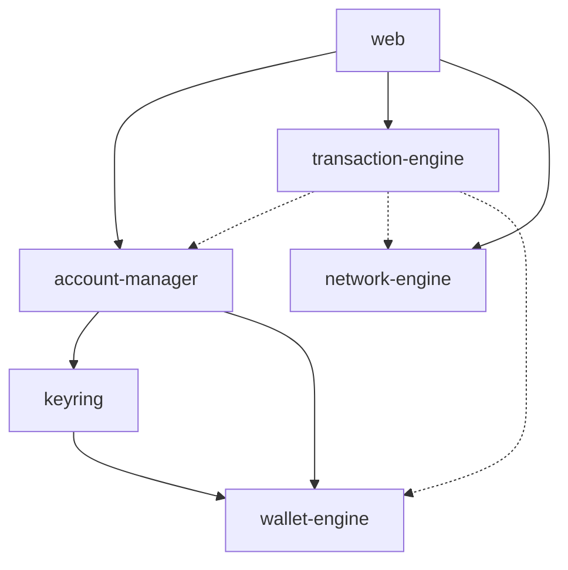

# ADR-001: Architecture Freeze & Dependency Boundaries

## 1. Status

**Approved** (Architecture Freeze Phase 1)

## 2. Context

As VaultX transitions into a production-grade Web3 wallet, the codebase is rapidly expanding into multiple standalone packages. To prevent a "big ball of mud" architecture, spaghetti code, or dangerous cryptographic leaks (e.g., UI layer silently accessing private keys), we are strictly formalizing the dependency graph, allowed directions, and bounded contexts.

## 3. Current Package Hierarchy

The repository currently contains the following domain isolation:

### Core Mathematics

- `@vaultx/wallet-engine`: Pure cryptography. BIP39, BIP32, HD Derivation. No network. No UI. No Storage.

### Security & Persistence

- `@vaultx/keyring`: Symmetric encryption layer (AES-256-GCM, PBKDF2). Consumes `@vaultx/wallet-engine`. Serializes state.

### Orchestration

- `@vaultx/account-manager`: Ties the Keyring to physical Storage Interfaces. Manages Session locking/timeouts.
- `@vaultx/network-engine`: Manages RPC endpoints, provider health, chain registries, and network failover caching. Completely independent of accounts.

### Frontend

- `@vaultx/web`: The React UI. Consumes orchestration packages.

## 4. Dependency Graph

_(Note: `transaction-engine` is planned for Phase 3 but the topological boundaries are established here)._

## 5. Architectural Rules & Forbidden Dependencies

To ensure zero circular dependencies and maximum security isolation, the following strict rules apply to all future additions:

1. **Rule of Isolation**: The UI (`@vaultx/web`, or future mobile apps) MUST NEVER interact directly with `@vaultx/keyring` or `@vaultx/wallet-engine` primitives to extract plaintexts. It must only interact with `@vaultx/account-manager` interfaces which yield sanitized `ExportedWallet` projections.
2. **Rule of Ignorance**: `@vaultx/network-engine` MUST NEVER know about mnemonics, private keys, or passwords.
3. **Rule of Independence**: `@vaultx/keyring` MUST NEVER know about network providers, transactions, or Ethers execution layers. It only encrypts bytes.
4. **Rule of Orchestration**: `@vaultx/transaction-engine` (when built) will act as the bridge. It will request an Ethers Signer from the `account-manager`, request a Provider from the `network-engine`, and combine them.

## 6. Extension & Plugin Strategy

- **Abstract Interfaces**: Packages requiring external IO (Storage, Network fetchers) must expose an Interface (e.g., `StorageInterface`) rather than coupling to `window.localStorage` or `node:fs`.
- **Plugin Registries**: Custom blockchains can be added at runtime via `networkEngine.registerCustomChain()`, meaning core constants never need to hardcode obscure forks.

## 7. Testing Strategy

- **Unit Isolation**: Every package must maintain `100%` independent testing utilizing `vitest`.
- **Mocking Boundaries**: Tests in higher-level packages (`account-manager`) will utilize `vi.mock` for lower-level primitives if they introduce significant latency (e.g., overriding PBKDF2 iterations in test environments to speed up suites).
- **Type Safety**: The root `pnpm run typecheck` will aggressively validate all composite projects using `--noEmit` and strictly typed references.
